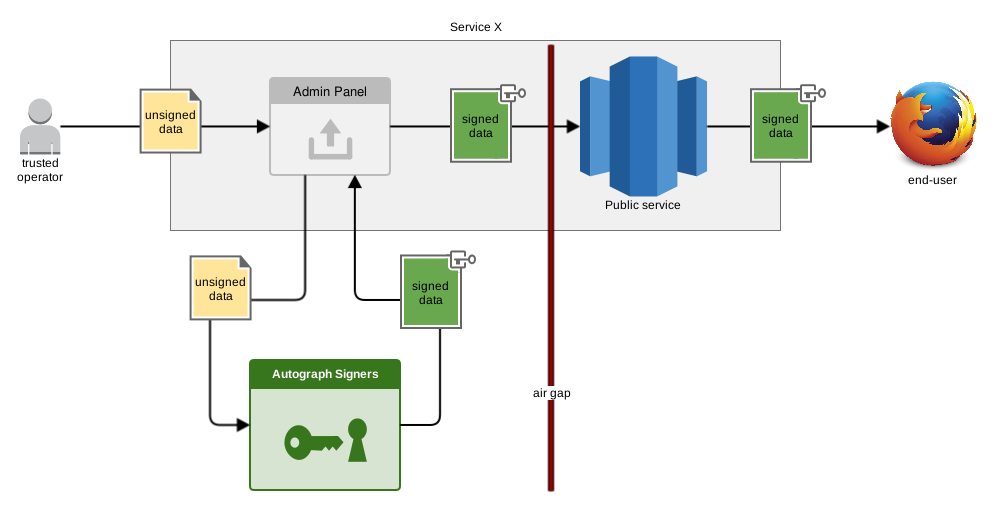

# Autograph
Autograph is a cryptographic signature service that implements
[Content-Signature](https://github.com/martinthomson/content-signature/)
and other signing methods.

[](https://travis-ci.org/mozilla-services/autograph)

## Rationale

As we rapidly increase the number of services that send configuration data to
Firefox agents, we also increase the probability of a service being
compromised to serve fraudulent data to our users. Autograph implements a way
to sign the information sent from backend services to Firefox user-agents, and
protect them from a service compromise.

Digital signature adds an extra layer to the ones already provided by TLS and
certificates pinning. As we grow our service infrastructure, the risk of a
vulnerability on our public endpoints increases, and an attacker could exploit
a vulnerability to serve bad data from trusted sites directly. TLS with
certificate pinning prevents bad actors from creating fraudulent Firefox
services, but does not reduce the impact a break-in would have on our users.
Digital signature provides this extra layer.

Finally, digital signature helps us use Content Delivery Network without
worrying that a CDN compromise would end-up serving bad data to our users.
Signing at the source reduces the pressure off of the infrastructure and
allows us to rely on vendors without worrying about data integrity.

## Architecture

### Signing

Autograph exposes a REST API that services can query to request signature of
their data. Autograph knows which key should be used to sign the data of a
service based on the service's authentication token. Access control and rate
limiting are performed at that layer as well.



### Certificate issuance and renewal

Autograph signs data using ECDSA keys. The autograph public certs are signed
by intermediate certs stored in HSMs, themselves signed by a Root CA stored
offline. The Root CA is trusted in NSS, but for specific purposes only (eg. not
signing website certs). Upon verification of a signature issued by Autograph,
Firefox clients verify the full chain of trust against the root CAs, like any
other PKI.


Accessing the RootCA requires multiple people and a key ceremony, so we only do
it every couple of years to reissue intermediate certificates. The
intermediates are kept safely in HSMs where their private keys cannot be
exported or stolen.

Every month-or-so, the autograph signers are refreshed with new certificates
valid for only short period of time. Upon refresh, autograph calls the HSMs
API with a CSR to obtain signed certificates. Those certificates are then
stored in a public location when Firefox agents can retrieve them to verify
signatures.

## API

Authorization: All API calls require a
[hawk](https://github.com/hueniverse/hawk) Authorization header.

### /signature

#### Request

Request a signature. The data to sign is passed in the request body using the
JSON format described below. The caller can either request the signature of raw
data or the signature of pre-computed hashes.

When requesting the signature of raw data, autograph will determine which hash
function to use based on the key type (eg. p384 with sha384). If hashes are
submitted, autograph only verifies their length (eg. 48 bytes for sha384).

example:
```bash
POST /signature
Host: autograph.example.net
Content-type: application/json
Authorization: Hawk id="dh37fgj492je", ts="1353832234", nonce="j4h3g2", ext="some-app-ext-data", mac="6R4rV5iE+NPoym+WwjeHzjAGXUtLNIxmo1vpMofpLAE="

[
    {
        "template": "content-signature",
        "input": "y0hdfsN8tHlCG82JLywb4d2U+VGWWry8dzwIC3Hk6j32mryUHxUel9SWM5TWkk0d"
    },
    {
        "template": "content-signature",
        "hashwith": "sha384",
        "input": "c2lnbl9tZQo=",
        "keyid": "123456"
    }
]
```

Body format:
The request body is a json array where each entry of the array is an object to sign. The parameters are:

* template: tells Autograph to template the input data using custom logic. This
  is used to add or change the input data prior to hash and signing it. If set
  to "content-signature", the header `Content-Signature:\x00` is prepended to
  the input data prior to signing.

* hashwith: the algorithm to hash the input data with prior to signing. If
  omitted, autograph considers that the input data provided has already been
  hashed.

* input: base64 encoded data to sign

* keyid: allows the caller to specify a key to sign the data with. This
  parameter is optional, and Autograph will pick a key based on the caller's
  permission if omitted.

#### Response

A successful request return a `201 Created` with a response body containing signature elements encoded in JSON. The ordering of the response array is identical to the request array.

```json
[
  {
    "ref": "1d7febd28f",
    "certificate": {
        "x5u": "https://certrepo.example.net/db238be479dc759d464f804adf6e5febe6db4f1c4ac4aef07b1c6b55bb258954",
        "encryptionkey": "keyid=a1b2c3; p256ecdsa=BDUJCg0PKtFrgI_lc5ar9qBm83cH_QJomSjXYUkIlswXKTdYLlJjFEWlIThQ0Y-TFZyBbUinNp-rou13Wve_Y_A"
    },
    "signatures": [
      {
        "encoding": "b64url",
        "signature": "PWUsOnvlhZV0I4k4hwGFMc3LQcUlS-l1UwD0cNevPv3ux7T9moHX_JZHc75cmnyo-hUkW6s-c6AaNr_dyxg2528OLY53voIqwTsiYll1iPElS9TV0xOo3awuwnYcctOp",
        "hashalgorithm": "sha256"
      }
    ]
  },
  {
    "ref": "9aefebd25c",
    "certificate": {
        "x5u": "https://certrepo.example.net/db238be479dc759d464f804adf6e5febe6db4f1c4ac4aef07b1c6b55bb258954",
        "encryptionkey": "keyid=a1b2c3; p256ecdsa=BDUJCg0PKtFrgI_lc5ar9qBm83cH_QJomSjXYUkIlswXKTdYLlJjFEWlIThQ0Y-TFZyBbUinNp-rou13Wve_Y_A"
    },
    "signatures": [
      {
        "encoding": "b64url",
        "signature": "PWUsOnvlhZV0I4k4hwGFMc3LQcUlS-l1UwD0cNevPv3ux7T9moHX_JZHc75cmnyo-hUkW6s-c6AaNr_dyxg2528OLY53voIqwTsiYll1iPElS9TV0xOo3awuwnYcctOp",
        "hashalgorithm": "sha256"
      }
    ]
  }
]
```
